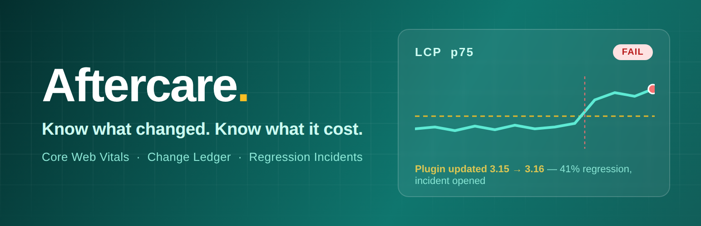
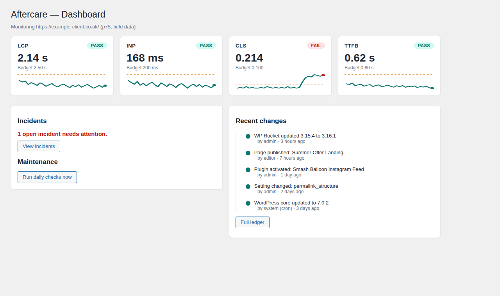
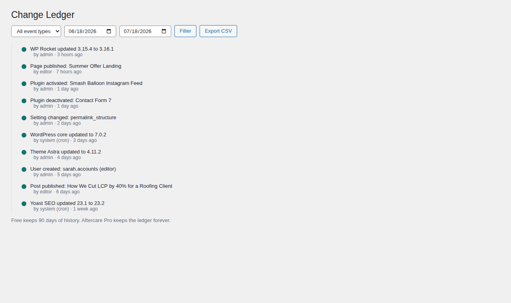
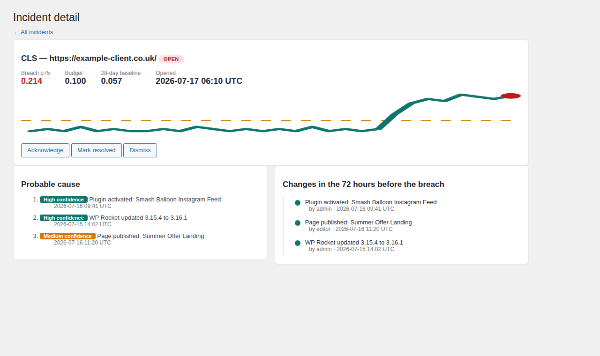
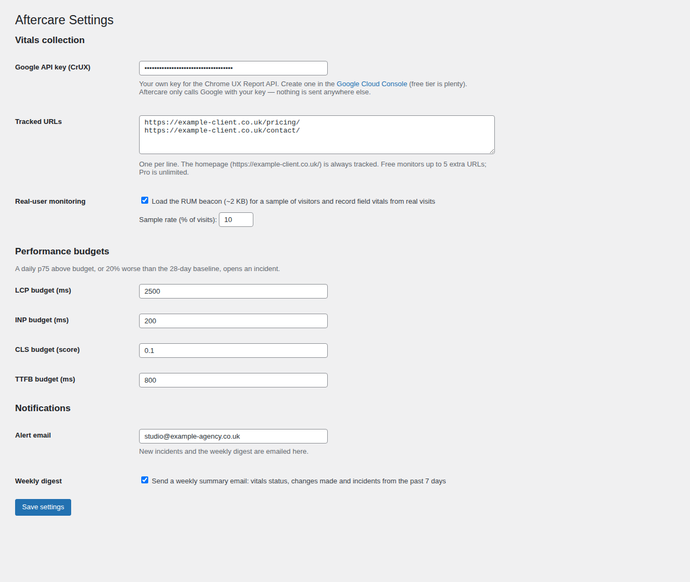

<p align="center">
  
</p>

<h1 align="center">Aftercare</h1>

<p align="center">
  <strong>Know what changed. Know what it cost. Prove what you did.</strong>
</p>

<p align="center">
  A free WordPress plugin for agencies, freelancers and site owners who look after WordPress sites long after launch —<br />
  it watches your Core Web Vitals every day, records every change made to the site, and opens an incident<br />
  the moment performance regresses, so you catch problems before your client (or your visitors) do.
</p>

<p align="center">
  
  
  
  
</p>

<p align="center">
  <a href="#-quick-start-under-5-minutes">Quick start</a> ·
  <a href="#what-the-free-plugin-includes">Features</a> ·
  <a href="#aftercare-pro">Pro</a> ·
  <a href="#screenshots">Screenshots</a> ·
  <a href="#roadmap-free">Roadmap</a> ·
  <a href="#development">Development</a>
</p>

<p align="center">
  Author: <a href="https://www.nomad-developer.co.uk/">Costi Botez</a> (<a href="https://www.instagram.com/costinbotez/">@costinbotez</a>) ·
  <a href="https://www.nomad-developer.co.uk/">Portfolio</a> ·
  <a href="https://www.instagram.com/costinbotez/">Instagram</a> ·
  <a href="https://github.com/costibotez">GitHub</a>
</p>

---

## Why Aftercare exists

Every site on a care plan eventually produces the same two conversations: *"the site feels slower — what happened?"* and *"what did you actually do this month?"* Aftercare answers both from data it collects automatically:

- A plugin update lands on Tuesday, LCP jumps 40% on Wednesday — Aftercare opens an incident, emails you, and shows every change from the 72 hours before the regression, side by side with the trend.
- A month of updates, publishes and settings changes becomes a scrollable, filterable ledger with a human-readable summary and the responsible user on every line.

## What the free plugin includes

### 📈 Core Web Vitals monitor
- Daily p75 values for **LCP, INP, CLS and TTFB** from the Chrome UX Report (real Chrome-user field data), fetched with your own free Google API key — origin-level fallback when URL-level data is thin
- Optional **real-user monitoring beacon**: ~2 KB, dependency-free (native `PerformanceObserver`), loaded for a configurable sample of visits, aggregated to daily p75 on your own site — no third-party service involved
- Homepage plus up to 5 tracked URLs, 30 days of history, sparkline trends with pass / warn / fail status pills

### 💰 Performance budgets & incidents
- Editable budgets per metric (defaults: LCP 2.5 s, INP 200 ms, CLS 0.1, TTFB 800 ms)
- A daily p75 over budget — or 20% worse than the 28-day baseline — opens an **incident** with the breach value, budget and baseline
- Email alert on every new incident; automatic resolution when the metric recovers
- Incident detail shows the raw change timeline from the 72 hours before the breach

### 📒 Change ledger
- Records plugin updates (old → new version), activations and deactivations, theme updates and switches, core updates, allow-listed settings changes (never secrets, values truncated), content publishes and new users
- Every entry is human-readable — "WP Rocket updated 3.15 to 3.16 by admin" — with actor and timestamp
- Filterable timeline by type and date, CSV export; 90 days of history

### 🧰 Fits into your workflow
- **WordPress dashboard widget** — vitals status pills and open incidents on the main wp-admin screen
- **Admin bar indicator** — a pass/warn/fail dot for administrators, on the front end too
- **Site Health integration** — tests for "API key configured", "daily checks running" and "budgets currently breached"
- **WP-CLI commands** — `wp aftercare pull`, `wp aftercare check`, `wp aftercare status`, `wp aftercare run`; point a real server cron at `wp aftercare run` and skip WP-Cron entirely
- **Weekly digest email** — vitals status, changes made and incidents from the past 7 days (opt-out in settings)
- **First-run setup guide** — a three-step pointer until vitals collection is configured
- **Privacy-policy helper** — suggested policy text for the RUM beacon via the WordPress privacy tools

### 🔒 Private by design
- **No phoning home.** CrUX calls go directly from your server to Google with your key; RUM beacons post to your own site's REST API; nothing is sent to us — there is no "us" to send it to
- All output escaped, all input sanitized, nonces and `manage_options` capability checks on every form and route
- Uninstall removes all tables and options unless you tick "keep data"

## ⚡ Quick start (under 5 minutes)

1. Install and activate the plugin.
2. Create a free Google API key with the [Chrome UX Report API](https://console.cloud.google.com/apis/library/chromeuxreport.googleapis.com) enabled.
3. Paste it in **Aftercare → Settings**, optionally add tracked URLs and enable RUM.
4. Press **Run daily checks now** on the dashboard — first vitals data appears immediately.

## Aftercare Pro

The free plugin tells you *that* something regressed and *what changed*. [Aftercare Pro](https://github.com/costibotez/aftercare#pro) tells you **which change probably did it** — and turns the month into client-ready proof:

- **Cause attribution** — every change from the 72 hours before a regression, ranked with high / medium / low confidence badges
- **White-label monthly client reports** — vitals vs last month, work performed, incidents caught and resolved; your logo, colours, personal note; print/PDF and email delivery
- **Slack and webhook notifications**, unlimited tracked URLs, per-URL budgets, 13-month history and unlimited ledger retention

## Roadmap (free)

- Guided multi-step onboarding wizard (replacing the current setup notice)
- Multisite network awareness
- Agency Hub: a central dashboard aggregating many sites (the REST endpoints are already versioned and site-agnostic for this)

## Screenshots

| Dashboard | Change Ledger |
|---|---|
|  |  |

| Incidents | Settings |
|---|---|
|  |  |

## Development

- WordPress 6.4+, PHP 8.1+. Vanilla PHP with a light PSR-4 structure under the `Aftercare\` namespace — no build step, no framework.
- **Distribution model:** this repository contains the full (premium) codebase. The WordPress.org free build is produced with `wp dist-archive .`, which excludes the premium-only files listed in `.distignore` (attribution engine, report builder, Slack/webhook notifiers) — directory guidelines forbid shipping locked functionality inside the free plugin. The free code degrades gracefully via `class_exists()` guards, so both builds run from the same source.
- Cron uses Action Scheduler when available (e.g. WooCommerce installs), WP-Cron otherwise, with a health warning when WP-Cron looks unreliable.

```
aftercare.php          Bootstrap + PSR-4 autoloader
uninstall.php          Clean removal (respects "keep data" setting)
src/
  Core/                Container, activation, migrations, cron, options
  Vitals/              CrUX client, RUM REST endpoint + aggregation, breach detector
  Ledger/              Hook listeners, event storage and queries
  Incidents/           Incident storage + attribution engine
  Reports/             Monthly report builder (Pro)
  Admin/               Dashboard / Ledger / Incidents / Reports / Settings screens
  Notifications/       Email (free), Slack + webhook (Pro)
  Licensing/           Pro gating
assets/                Admin CSS/JS (dependency-free SVG sparklines), RUM beacon
templates/             Incident email, report template
languages/             POT + Romanian translation
```

Useful hooks:

| Hook | Type | Purpose |
|---|---|---|
| `aftercare_incident_opened` / `aftercare_incident_resolved` | action | Incident lifecycle (feeds notifications) |
| `aftercare_budget` | filter | Override a budget per metric/URL |
| `aftercare_is_pro` | filter | Unlock Pro features (development / service installs) |
| `aftercare_attribution_causes` | filter | Adjust ranked causes for an incident |
| `aftercare_pdf_engine` | filter | Plug in a PDF engine (e.g. dompdf) for reports |

QA shortcut: **Dashboard → Run daily checks now** runs the full daily pipeline (CrUX pull → RUM aggregation → breach detection → retention) on demand. Lower a budget below the current value and run it to force an incident and the alert email.

## License

GPL-2.0-or-later.

---

<p align="center">
  
</p>

<p align="center">
  Built and maintained by <a href="https://www.nomad-developer.co.uk/">Costi Botez</a> — <a href="https://www.nomad-developer.co.uk/">Nomad Developer</a> · <a href="https://www.instagram.com/costinbotez/">@costinbotez</a><br />
  WordPress development, care plans and performance work for agencies and small businesses.
</p>
